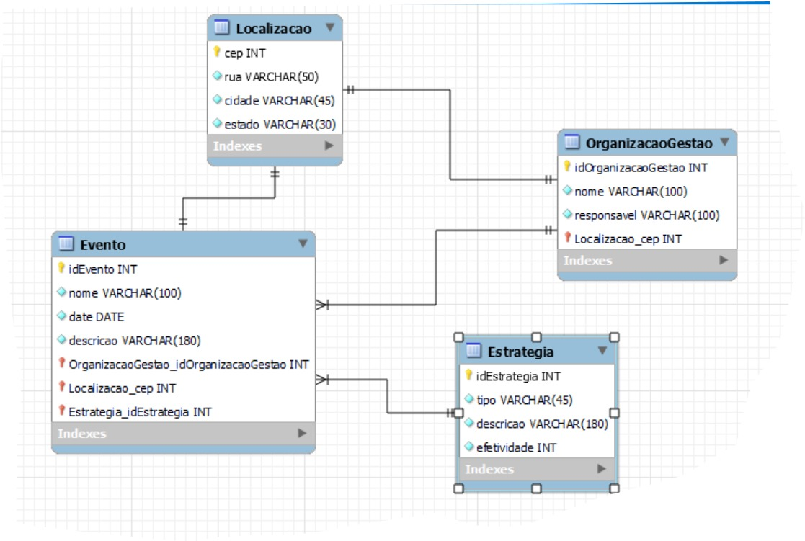

# Reciclagem de Comunidades Urbanas

## Descrição do Projeto

Este projeto visa implementar programas de reciclagem em comunidades urbanas com o objetivo de reduzir o desperdício e promover práticas sustentáveis. As iniciativas são gerenciadas por organizações locais que coordenam eventos voltados para a reciclagem e a gestão de resíduos.

### Entidades do Projeto

- **Organização de Gestão de Eventos:** Representa a entidade responsável pela organização de eventos.
  - **Atributos:** Nome, Localização, Responsável.
- **Eventos:** Representa os eventos organizados pelas Organizações de Gestão de Eventos.
  - **Atributos:** Nome, Data, Localização, Descrição.
  - **Relacionamento:** Muitos eventos pertencem a uma Organização de Gestão de Eventos.
- **Estratégias de Gestão de Resíduos:** Estratégias implementadas para gerenciar os resíduos durante os eventos.
  - **Atributos:** Tipo de Estratégia, Descrição, Efetividade.
  - **Tipos de Estratégia:** Reciclagem, Composta, Redução de Desperdício, Outra.

### DRE do banco 


O MER (Modelo Entidade-Relacionamento) é uma ferramenta de modelagem que descreve as entidades de um sistema, seus atributos e os relacionamentos entre elas. Ele ajuda a estruturar e visualizar a organização dos dados e as interações entre diferentes componentes de um banco de dados.

## Tecnologias Utilizadas

- **Linguagem:** TypeScript
- **Banco de Dados:** MySQL
- **ORM:** TypeORM
- **Node.js:** Ambiente de execução para JavaScript/TypeScript no backend.

## Como Executar o Projeto

1. **Clone o repositório:**

   ```bash
   git clone https://github.com/LailaMiranda/reciclagem-FAP.git
2. **Instale as dependências:**
npm install

3. **Crie o banco de dados:**
npm run create-db

4. **Inicie o servidor:**
npm start


## BANCO DE DADOS 

1. **Criação automatica do Bando de Dados:**

Esse código configura a criação automática de um banco de dados MySQL:

- **Conexão com MySQL**: Conecta ao servidor MySQL sem especificar um banco de dados inicial.
- **Verificação e Criação do Banco de Dados**: Verifica se o banco de dados já existe com `SHOW DATABASES LIKE`. Se não existir, ele o cria.
- **Inicialização do Data Source**: Após criar/verificar o banco, inicializa a conexão do TypeORM com `AppDataSource.initialize()`.
- **Automatização do Processo**: A função `setup()` combina a criação/verificação do banco e a inicialização da conexão de forma automática.

Resumindo, o código garante que o banco exista antes de inicializar a aplicação, automatizando todo o processo.


```ts
import mysql from 'mysql2/promise';
import { AppDataSource } from './data-source';

async function createDatabaseIfNotExists() {
  const connection = await mysql.createConnection({
    host: 'localhost',
    user: 'root',
    password: 'root',
  });

  const databaseName = process.env.DB_NAME || 'reciclagem';

  try {
    const [rows] = await connection.query('SHOW DATABASES LIKE ?', [databaseName]) as [mysql.RowDataPacket[], mysql.FieldPacket[]];
    
    if (rows.length === 0) {
      await connection.query('CREATE DATABASE ??', [databaseName]);
      console.log(`Database '${databaseName}' criada com sucesso.`);
    } else {
      console.log(`Database '${databaseName}' ja existe.`);
    }
  } catch (error) {
    console.error('Erro criando a database:', error);
} finally {
    await connection.end();
  }
}

async function initializeDataSource() {
  await AppDataSource.initialize();
  console.log('DataSource initialized successfully.');
}

async function setup() {
  await createDatabaseIfNotExists();
  await initializeDataSource();
}
setup().catch(error => console.error('Setup failed:', error));
```


2. **Configuração de Banco de Dados:**

O projeto utiliza MySQL. Certifique-se de que o MySQL esteja rodando localmente e que a configuração no arquivo AppDataSource.ts esteja correta:

```ts

import { DataSource } from 'typeorm';
import { Estrategia } from '../entities/Estrategia';
import { Evento } from '../entities/Evento';
import { OrganizacaoGestao } from '../entities/OrganizacaoGestao';
import { Localizacao } from '../entities/Localizacao';

export const AppDataSource = new DataSource({
  type: 'mysql',
  host: 'localhost',
  port: 3306,
  username: 'root', //usuario do banco 
  password: 'root', //senha do banco
  database: 'reciclagem', //Nome do banco
  entities: [Estrategia, Evento, OrganizacaoGestao, Localizacao],
  synchronize: true, 
  logging: true,
});

```
## Utilizando QUERY
```ts

SELECT * FROM localizacao;
SELECT * FROM organizacao_gestao;
SELECT * FROM evento;
SELECT * FROM estrategia;

SELECT * FROM estrategia WHERE tipoEstrategia = 'Reciclagem';
SELECT * FROM estrategia WHERE tipoEstrategia = 'Outra';

SELECT e.id AS evento_id, e.nome AS evento_nome, s.id_Estrategia, s.descricao AS estrategia_descricao, s.efetividade
FROM evento e
JOIN estrategia s ON e.id = s.eventoId;

SELECT e.id AS evento_id, e.nome AS evento_nome, l.cep, l.rua, l.cidade, l.estado
FROM evento e
JOIN localizacao l ON e.localizacaoCep = l.cep;

```
